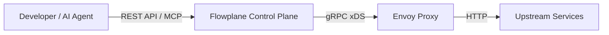

# Flowplane

A control plane for [Envoy proxy](https://www.envoyproxy.io/) that manages gateway configuration through a CLI, REST API, or MCP server. Stores clusters, listeners, routes, and filters in PostgreSQL and pushes them to Envoy via xDS.

## Quick Start

```bash
git clone https://github.com/rajeevramani/flowplane.git && cd flowplane
cargo install --path . --locked
flowplane init --with-envoy --with-httpbin
flowplane expose http://httpbin:80 --name demo
curl http://localhost:10001/get
```

`expose` creates a cluster (upstream), route config (path matching), and listener (Envoy port) in one command. Traffic flows through Envoy — you'll see `server: envoy` in the response headers.

```
{
  "headers": {
    "X-Envoy-Expected-Rq-Timeout-Ms": "15000",
    ...
  },
  "url": "http://localhost:10001/get"
}
```

```bash
flowplane status    # 1 listener, 1 cluster, 0 filters
flowplane list      # demo → port 10001
flowplane down      # stop everything
```

## Architecture


```mermaid
graph LR
    Dev[Developer / AI Agent] -->|REST API / MCP| CP[Flowplane Control Plane]
    CP -->|gRPC xDS| Envoy[Envoy Proxy]
    Envoy -->|HTTP| US[Upstream Services]
```

## Key Features

- **xDS control plane** — ADS, LDS, RDS, CDS, EDS, and SDS over gRPC
- **10 HTTP filters** — JWT auth, OAuth2, CORS, rate limiting, header mutation, ext authz, RBAC, compression, custom response, MCP
- **69 MCP tools** — AI agents can deploy and manage gateway configuration end-to-end
- **API schema learning** — capture live traffic, infer JSON schemas, export as OpenAPI with enum detection, path normalization, and domain model dedup
- **Multi-tenant** — org/team hierarchy with Zitadel RBAC
- **REST API + Web UI** — JSON API and SvelteKit dashboard on port 8080

## Documentation

| Topic | Link |
|-------|------|
| Full walkthrough | [Getting Started](docs/getting-started.md) |
| Learn APIs from traffic | [Learning Quickstart](docs/learning-quickstart.md) |
| CLI commands | [CLI Reference](docs/cli-reference.md) |
| Filter configuration | [Filters](docs/filters.md) |
| MCP tools | [MCP Integration](docs/mcp.md) |

## Production Mode

```bash
make up HTTPBIN=1 ENVOY=1    # full stack with Zitadel
make seed                     # create demo org and credentials
flowplane auth login          # OIDC login
```

See [Production Quickstart](docs/quickstart.md) for details.

## Claude Code Skills

This repo ships with [Claude Code](https://claude.ai/code) skills in `.claude/skills/` that give AI assistants deep context about the codebase. They load automatically when Claude Code detects a matching task.

**For agents operating the gateway** (deploy, configure, diagnose via MCP):

| Skill | Covers |
|-------|--------|
| `flowplane-api` | 69 MCP tools, learning sessions, filter attach/detach, routing workflows |
| `flowplane-ops` | Boot recipes, 6 diagnostic MCP tools, troubleshooting playbooks |
| `flowplane-secrets` | SDS secrets, encryption keys, filter integration |
| `create-filter-test` | Generate test fixtures for filter configurations |

**For developers working on the codebase:**

| Skill | Covers |
|-------|--------|
| `flowplane-dev` | Architecture, domain model, auth modes, boot lifecycle, filter system |
| `flowplane-cli` | CLI command reference with flags, syntax, and examples |
| `flowplane-testing` | Test layers, E2E framework, anti-patterns |

Skills are tracked in git so they stay in sync with the code. The `.claude/` directory is otherwise gitignored (settings, memory, and tasks remain private).

## Requirements

- Docker or Podman
- Rust 1.92+

## License

MIT — see [LICENSE](LICENSE).
