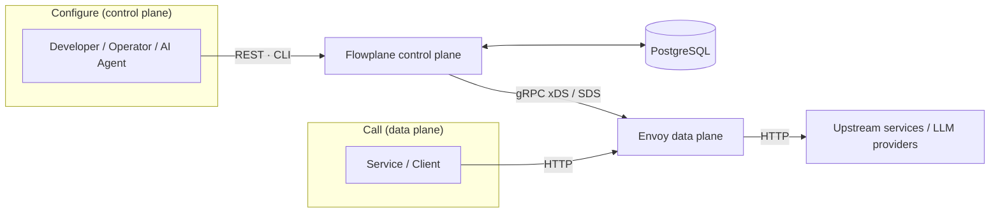

# Flowplane

**Flowplane** — an API gateway built for humans and AI agents.

Publish your APIs through a multi-tenant control plane and get governance (OIDC auth, grant-based RBAC, audit), a deterministic Envoy data plane driven over xDS, schema learning that infers OpenAPI from live traffic, and an AI gateway that fronts LLM providers with token budgets. Drive it from a CLI or REST API.

> A ground-up Rust/PostgreSQL rebuild. PostgreSQL is the source of truth, Envoy is the only data plane, xDS/SDS is the config channel, and every product mutation goes through `fp-core` services.

## Quick Start

Install local evaluation infrastructure with **no exposed APIs**, then explicitly expose and call a backend through Envoy. No checkout or `cargo build` is needed for the published-artifact path.

**Start with the [evaluation learning path](docs/tutorials/evaluate-no-clone.md)**, or go straight to [Install and verify Flowplane](docs/tutorials/eval-install-and-verify.md). The five short tutorials cover installation, your first API, your own backend, a local rate limit, and safe removal. Each uses manual steps with expected results.

> **3.2.0 release preparation:** matching eval images are not yet published; packaged-candidate qualification is pending. Older `3.1.x` bundles automatically expose the demo and do not implement this empty-install/shared-exposure journey. This local-only dev bundle is not a production deployment.

For startup diagnostics or preserving/resuming an evaluation, use [evaluation readiness and recovery](docs/how-to/evaluation-readiness-and-recovery.md). For additional ports and exposure modes, use [Expose an API](docs/how-to/expose-an-api.md).

## Architecture

```mermaid
graph LR
    subgraph Configure["Configure (control plane)"]
        Op[Developer / Operator / AI Agent]
    end
    subgraph Call["Call (data plane)"]
        Cl[Service / Client]
    end

    Op -->|REST · CLI| FP[Flowplane control plane]
    FP <--> PG[(PostgreSQL)]
    FP -->|gRPC xDS / SDS| Envoy[Envoy data plane]

    Cl -->|HTTP| Envoy
    Envoy -->|HTTP| US[Upstream services / LLM providers]
```

Flowplane is the **control plane**: it stores gateway configuration (clusters, routes, listeners, filters, secrets) in PostgreSQL and pushes it to Envoy over xDS. It is out-of-band of request traffic — clients call Envoy directly, and Envoy proxies to upstreams. PostgreSQL is the single source of truth; the same database state always produces the same Envoy configuration bytes.

## Key Features

- **Multi-tenant by construction** — organizations own teams; teams own gateway resources. Every tenant query names whose data it touches (`TeamScope`), so an unscoped cross-tenant query is not representable. Cross-tenant existence is hidden (`404`, not `403`).
- **Grant-based authorization** — one pure-function gate decides every access on every surface (REST, CLI). Access is a decision over a closed `(resource, action, team)` grant vocabulary; every decision returns a stable reason for audit.
- **Provider-neutral OIDC auth** — works with any compliant IdP (Auth0, Keycloak, Okta, Entra) plus an in-process dev mock for local runs. JWTs are identity-only; all authorization comes from the database.
- **Deterministic xDS data plane** — CDS/RDS/LDS/EDS/SDS over ADS. Stable encoding, per-type versions that bump only on real byte changes, and NACK quarantine that serves last-known-good rather than blanking a resource type. mTLS/SPIFFE identity, per-dataplane scoping.
- **HTTP filter chain** — a closed set of nine filter kinds: CORS, local and global rate limit, header mutation, health check, compressor, JWT auth, ext authz, and RBAC. Per-route overrides supported; chain order is semantic.
- **API schema learning + discovery** — capture live traffic and infer JSON schemas with confidence scoring, exported as OpenAPI 3.1. *Learning* enriches an existing API definition; *discovery* spins up a throwaway listener and creates new API definitions from observed traffic.
- **AI gateway** — register LLM providers (OpenAI / OpenAI-compatible), publish AI routes, and cap token spend with budgets that run in `shadow` (observe-only) then `enforcing`. Provider credentials are encrypted at rest.
- **REST API + CLI** — a JSON API and a full-surface `flowplane` CLI covering auth/context, org/team management, gateway resources, expose/unexpose, learning, AI, secrets, dataplane registration, and ops diagnostics. Print the exact contract with `flowplane openapi`.
- **Read-only team dashboard** — run `flowplane dashboard` for Overview, Resources, APIs, Learning, AI, MCP, and Operations views using the CLI's resolved credentials. The bearer token stays in the CLI process and every browser route requires a per-launch nonce.

> An MCP control-plane surface is present in the codebase and evolving. The dashboard is a CLI-hosted read-only presentation layer over the existing REST API, not a second control plane.

## Documentation

- **Evaluate locally:** [Evaluation learning path](docs/tutorials/evaluate-no-clone.md).
- **Configure your gateway:** [Expose an API](docs/how-to/expose-an-api.md).
- **Evaluate a production-shaped setup:** [Platform evaluation](docs/how-to/evaluate-platform.md).
- **Build and run from source:** [Build and run from source](docs/tutorials/build-and-run-from-source.md).
- **All guides and references:** [Documentation home](docs/README.md).

## Contributing

Working on Flowplane itself? Use [Build and run from source](docs/tutorials/build-and-run-from-source.md) to build and run a local gateway, and the [contributor guide](CONTRIBUTING.md) for build, test and API-contract commands.

## License

Apache-2.0.
