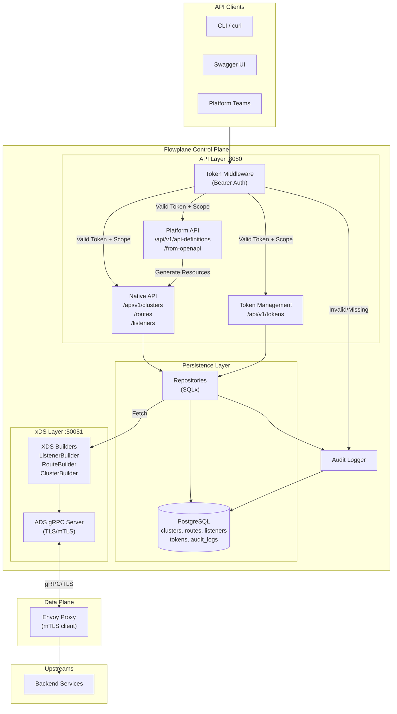

# Architecture Overview

Flowplane is a production-ready Envoy control plane that translates REST API calls into Envoy xDS resources. The architecture emphasizes security-first design, structured configuration models, and separation between API management, resource persistence, and xDS serving.

## Core Design Philosophy

1. **Security by Default**: Every API endpoint protected with scoped token authentication, comprehensive audit logging
2. **Developer Experience**: High-level structured configs instead of raw Envoy protos, OpenAPI-first documentation
3. **Extensibility**: Modular HTTP filter registry, Platform API layer for multi-team workflows
4. **Production Ready**: TLS/mTLS support, PostgreSQL for persistence

## High-Level Flow

1. **Authentication Layer**: Token middleware validates bearer tokens against stored credentials with scope-based authorization
2. **API Handlers** (`src/api`): Accept JSON payloads, validate schemas, enforce permissions, persist to database
3. **Audit System**: All authentication events and resource changes logged to `audit_logs` table
4. **XDS Builders** (`src/xds`): Transform stored records into Envoy protobuf resources (Listener, Route, Cluster)
5. **ADS Server**: gRPC server publishes resources to Envoy proxies, supports TLS/mTLS
6. **Platform API** (`src/platform_api`): Higher-level abstractions for API gateway workflows (OpenAPI import, shared listeners)



## Key Modules

### Authentication & Security (`src/auth`, `src/audit`)
* **`auth/middleware.rs`** – Bearer token validation, scope enforcement, request authentication
* **`auth/token_service.rs`** – Token CRUD, rotation, bootstrap token generation
* **`auth/models.rs`** – Token, scope, and permission data structures
* **`audit/logger.rs`** – Audit event recording (auth failures, resource changes, token operations)
* **Bootstrap token** – Auto-generated admin token displayed in prominent banner on first startup

### API Layer (`src/api`)
* **`routes.rs`** – All REST endpoint definitions, OpenAPI spec generation via `utoipa`
* **Native API handlers** – Direct resource management (clusters, routes, listeners)
* **Token management endpoints** – Create, list, update, rotate, revoke tokens
* **Middleware stack** – Authentication, CORS, request logging, error handling

### Platform API (`src/platform_api`)
* **`api_definition.rs`** – High-level API gateway abstraction (BFF pattern)
* **`openapi_import.rs`** – Parse OpenAPI 3.0 specs, generate clusters/routes/listeners
* **`defaults.rs`** – Shared gateway resources (default-gateway-listener on port 10000)
* **Team isolation** – Multi-tenant support with query parameter-based namespacing

### XDS Translation (`src/xds`)
* **`filters/http/`** – HTTP filter registry and structured configs
  * `mod.rs` – Filter registry, router enforcement, `typed_per_filter_config` support
  * `local_rate_limit.rs` – Token bucket rate limiting (global and per-route)
  * `jwt_auth.rs` – JWT validation with providers, requirements, claim extraction
  * `cors.rs` – First-class CORS policy configuration
  * `custom_response.rs` – User-friendly custom error responses
  * `header_mutation.rs` – Request/response header manipulation
* **`listener.rs`** – Listener → Envoy proto translation (TLS, filter chains, connection manager)
* **`route.rs`** – RouteConfiguration builder with path matching, method filtering, typed configs
* **`cluster.rs`** – Cluster assembly (endpoints, load balancing, health checks, circuit breakers, TLS)

### Persistence (`src/storage`)
* **Repository pattern** – Abstract database operations (PostgreSQL)
* **Migrations** – sqlx-based schema versioning
* **Tables**: `clusters`, `routes`, `listeners`, `tokens`, `audit_logs`, `api_definitions`

### Configuration (`src/config`)
* **`mod.rs`** – Environment variable parsing, TLS settings, bind addresses, ports
* **`settings.rs`** – Database URL, observability flags (metrics, tracing)

### xDS Server (`src/xds_server`)
* **ADS (Aggregated Discovery Service)** – Implements Envoy xDS protocol v3
* **gRPC server** – Tonic-based, supports TLS/mTLS for data plane communication
* **Resource versioning** – Tracks configuration changes, pushes updates to Envoy
* **TLS configuration** – Server certificate, client CA validation, optional mTLS

## Design Principles

### Security First
* **Zero-trust authentication** – All endpoints require valid bearer tokens with appropriate scopes
* **Audit everything** – Comprehensive audit trail for security events and resource changes
* **Defense in depth** – TLS for API (optional), TLS/mTLS for xDS (configurable), tokens in database (hashed)
* **Least privilege** – Granular scopes (tokens:*, clusters:*, routes:*, listeners:*) enforced at middleware layer

### Developer Experience
* **Structured configs first** – High-level Rust structs instead of raw Envoy protos or base64 blobs
* **OpenAPI-first** – Auto-generated API docs via `utoipa`, interactive Swagger UI
* **Validation early** – Schema validation and business logic checks at API layer with descriptive error messages
* **Platform abstractions** – OpenAPI import endpoint for instant gateway creation without manual resource assembly

### Operational Excellence
* **Idempotent operations** – PUT operations can be safely retried, builders generate consistent output
* **Resource isolation** – Platform API supports team-based namespacing with shared or dedicated listeners
* **Configuration persistence** – All resources stored in database, survive restarts
* **Graceful defaults** – Bootstrap token for initial setup, default gateway resources for zero-config imports

### Code Quality
* **Test coverage** – 168+ unit tests, E2E integration tests with real Envoy
* **Type safety** – Strong Rust typing prevents configuration errors at compile time
* **Repository pattern** – Database abstraction uses PostgreSQL
* **Modular filters** – HTTP filter registry allows easy addition of new filters following established patterns

## Security Model

### Token Scopes
Flowplane enforces fine-grained access control through token scopes:

| Scope | Operations | Resources |
|-------|-----------|-----------|
| `tokens:read` | List, view tokens | Token metadata (not secrets) |
| `tokens:write` | Create, rotate, revoke tokens | Full token management |
| `clusters:read` | List, view clusters | Cluster configurations |
| `clusters:write` | Create, update, delete clusters | Cluster resources |
| `routes:read` | List, view routes | Route configurations |
| `routes:write` | Create, update, delete routes, API definitions | Route resources |
| `listeners:read` | List, view listeners | Listener configurations |
| `listeners:write` | Create, update, delete listeners | Listener resources |

### Audit Trail
All security-sensitive operations are logged to `audit_logs` table:
- Authentication successes and failures
- Token creation, rotation, and revocation
- Resource creation, updates, and deletion
- Scope violations and authorization failures

### Bootstrap Security
On first startup:
1. Flowplane generates a cryptographically random admin token (`fp_pat_...`)
2. Token displayed in **prominent ASCII art banner** (stderr) for operator to capture
3. Event logged to audit trail (`auth.token.seeded`)
4. Operator must extract token and store securely
5. Use admin token to create scoped service tokens
6. Rotate or revoke bootstrap token after setup

## Request Flow Example

```
1. Client sends: POST /api/v1/clusters
   Headers: Authorization: Bearer fp_pat_abc123...

2. Middleware extracts token, queries `tokens` table
   - Validate token exists and not expired
   - Check scope contains "clusters:write"
   - Log authentication success to audit

3. Handler validates request body
   - JSON schema validation (required fields, types)
   - Business logic validation (endpoint format, timeouts)
   - Return 400 Bad Request if invalid

4. Repository persists to database
   - INSERT or UPDATE clusters table
   - Transaction ensures consistency

5. XDS builder detects change
   - Fetches all clusters from database
   - Builds Envoy Cluster protos
   - Notifies ADS server

6. ADS server pushes update
   - Envoy sends DiscoveryRequest
   - Server responds with updated ClusterDiscoveryResponse
   - Envoy acknowledges, applies config

7. Return 201 Created to client
   - Include stored resource in response body
```

## Multi-Tenancy Model

Flowplane uses a hierarchical org-based tenancy model: **Organizations** contain **Teams**, and all resources (clusters, routes, listeners) belong to teams. Platform admins operate in a governance-only capacity — they manage orgs and users but cannot directly modify tenant resources.

Flowplane supports team isolation through the Platform API:

### Shared Listener Mode (Default)
- All API definitions join `default-gateway-listener` on port 10000
- Teams share a single listener, routes namespaced by path prefix or domain
- Zero configuration required, instant onboarding
- Cost-efficient for low-traffic teams

### Dedicated Listener Mode
- Query parameters: `?listener=myteam&port=8080&bind_address=0.0.0.0`
- Creates separate listener per team/gateway
- Full isolation, independent filter configuration
- Allows per-team rate limits, JWT providers, CORS policies

### Resource Naming
- Platform API resources prefixed by team: `{team}-{resource}`
- Native API resources use exact names provided
- Prevents collision between teams, supports multi-tenancy

## Observability

### Structured Logging
- JSON-formatted logs with configurable levels (RUST_LOG)
- Request IDs for correlation across layers
- Error context propagation from database to API layer

### Metrics (Optional)
- Prometheus-compatible endpoint (configurable via FLOWPLANE_ENABLE_METRICS)
- Request counts, latencies, error rates by endpoint
- Token validation success/failure rates

### Tracing (Optional)
- OpenTelemetry support (FLOWPLANE_ENABLE_TRACING)
- Jaeger integration (FLOWPLANE_JAEGER_ENDPOINT)
- Distributed tracing across API → database → xDS

### Audit Logs
- Database-persisted audit trail (not just ephemeral logs)
- Queryable via SQL for security investigations
- Retention policy configurable per deployment

## MCP & AI Agent Architecture

Flowplane includes an MCP (Model Context Protocol) server that exposes control plane operations as AI-consumable tools. The MCP layer provides 60+ tools and 7 prompts for managing Envoy resources programmatically.

Three built-in AI agents leverage MCP tools for different personas:
- **Dev Agent** — Focuses on service onboarding, routing, and schema learning
- **Ops Agent** — Handles listener management, TLS, and operational concerns
- **DevOps Agent** — Combines both capabilities for full-stack gateway management

## Extension Points

### Adding HTTP Filters
1. Create struct in `src/xds/filters/http/my_filter.rs`
2. Implement `to_envoy_proto()` method returning `Any`
3. Register in `src/xds/filters/http/mod.rs` filter registry
4. Add JSON schema to request/response models
5. Update OpenAPI documentation via `utoipa` attributes
6. Write unit tests for proto conversion
7. Add E2E test with real Envoy

See `cors.rs` or `header_mutation.rs` for reference implementations.

### Supporting New xDS Resources
The current implementation focuses on LDS (Listeners), RDS (Routes), CDS (Clusters), EDS (Endpoints). To add new resources:

1. Define Rust model in `src/models/`
2. Create repository in `src/storage/`
3. Add API endpoints in `src/api/`
4. Implement builder in `src/xds/`
5. Wire into ADS server response logic
6. Add database migration for persistence

## Technology Stack

| Component | Technology | Purpose |
|-----------|-----------|---------|
| **HTTP Server** | Axum 0.7 | REST API framework with tower middleware |
| **gRPC Server** | Tonic 0.12 | Envoy xDS protocol implementation |
| **Database** | SQLx + PostgreSQL | Configuration persistence, migrations |
| **Authentication** | Bearer tokens (SHA-256) | API security, scope enforcement |
| **Observability** | tracing + prometheus | Logging, metrics, distributed tracing |
| **API Documentation** | utoipa | Auto-generated OpenAPI 3.0 spec |
| **Protobuf** | envoy-types | Rust bindings for Envoy protos |
| **TLS** | rustls | Control plane and xDS TLS/mTLS |
| **Async Runtime** | Tokio | Non-blocking I/O, gRPC streaming |
| **Serialization** | serde | JSON ↔ Rust struct conversion |

## Future Roadmap

### v0.1.0 Targets
* **Additional HTTP filters** – ext_authz, RBAC, WASM support following filter registry pattern
* **PostgreSQL hardening** – Connection pooling, prepared statements, query optimization
* **Metrics dashboard** – Pre-built Grafana dashboards for common operational metrics
* **Enhanced CLI** – Interactive mode, resource templates, bulk operations
* **Kubernetes operator** – CRDs for declarative gateway management

### Long-term Exploration
* **gRPC gateway support** – Proxy gRPC services with transcoding
* **A2A protocol** – Application-to-application communication patterns
* **MCP enhancements** – Extended Model Context Protocol tooling
* **GraphQL gateway** – GraphQL → REST translation with schema stitching
* **Policy engine** – OPA integration for advanced authorization
* **Delta xDS** – Incremental configuration updates for scale
* **Hot reload** – Zero-downtime configuration updates

## Contributing

Contributions aligning with these principles help keep Flowplane predictable and maintainable:
1. Security first – All new endpoints must enforce authentication
2. Test coverage – New filters require unit + E2E tests
3. Documentation – Update OpenAPI specs and user-facing docs
4. Backward compatibility – Database migrations must not break existing deployments

See [CONTRIBUTING.md](../CONTRIBUTING.md) for development workflow and PR guidelines.
