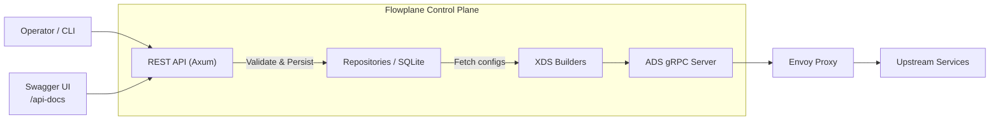

# Architecture Overview

The codebase is organized around the translation between REST payloads and Envoy xDS protos, backed by a simple state store.

## High-Level Flow
1. API handlers (`src/api`) accept JSON payloads, validate them, and persist records via the repository layer.
2. The XDS builder modules (`src/xds`) read stored records and construct Envoy resources (`Listener`, `RouteConfiguration`, `Cluster`).
3. The ADS server publishes resources to connected Envoy instances whenever data changes.

## Key Modules
* `src/xds/filters` – Shared helpers for constructing protobuf `Any` payloads, Base64 utilities, and typed config wrappers.
  * `http/mod.rs` – Registry of HTTP filters, router enforcement, scoped config decoding.
  * `http/local_rate_limit.rs` – Structured Local Rate Limit config.
  * `http/jwt_auth.rs` – Structured JWT auth config with providers, requirements, and per-route overrides.
* `src/xds/listener.rs` – Listener translation logic (TLS contexts, access log, tracing, filter chains).
* `src/xds/route.rs` – Route configuration builders, typed per-filter config support.
* `src/xds/cluster.rs` – Cluster assembly (load balancing, health checks, endpoints).
* `src/storage` – Repository abstractions and migration support.
* `src/api` – Axum handlers exposing REST endpoints, OpenAPI generation via `utoipa`.

## Design Principles
* **Structured configs first** – Expose high-level structs before falling back to base64 typed configs.
* **Validation early** – Reject bad payloads at the API layer with descriptive errors.
* **Idempotent builds** – Resource builders derive full Envoy protos from stored state so reconcilers can rerun safely.
* **Test coverage** – Each translation module includes unit tests; smoke tests verify E2E behavior.

## Future Directions
* Additional HTTP filters (e.g., ext_authz, RBAC) using the same pattern.
* gRPC/ADS enhancements (MCP, delta XDS).
* Observability wiring for stats/log export.

Contributions aligning with these principles help keep the control plane predictable and maintainable.
