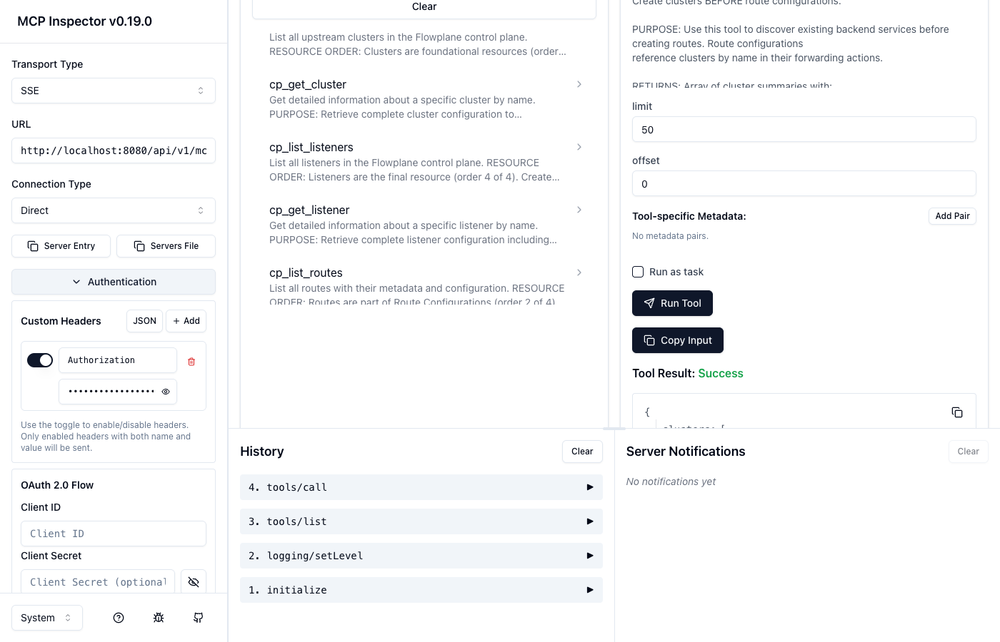
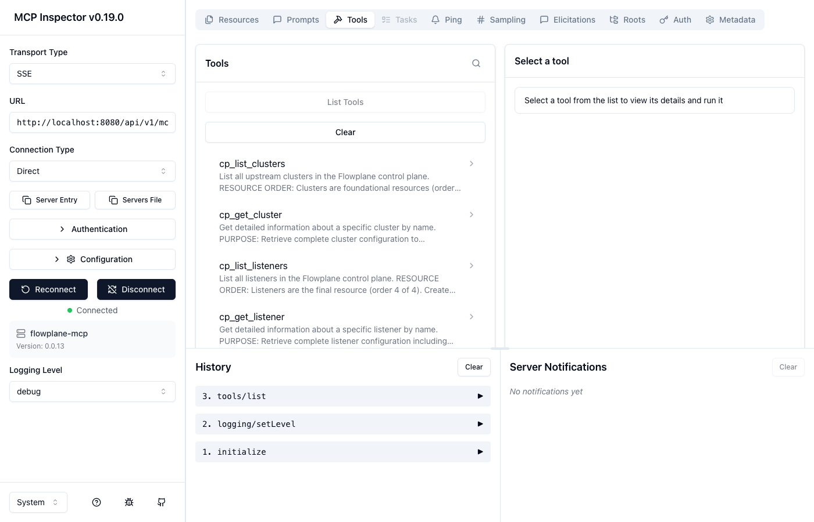
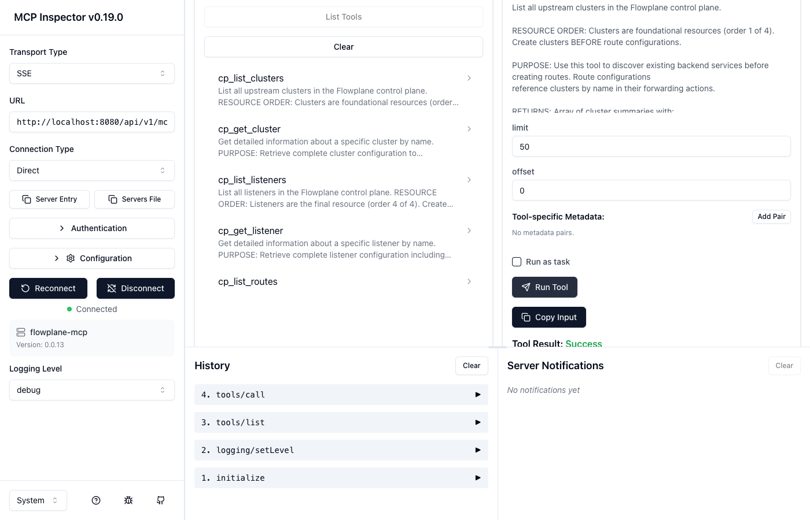
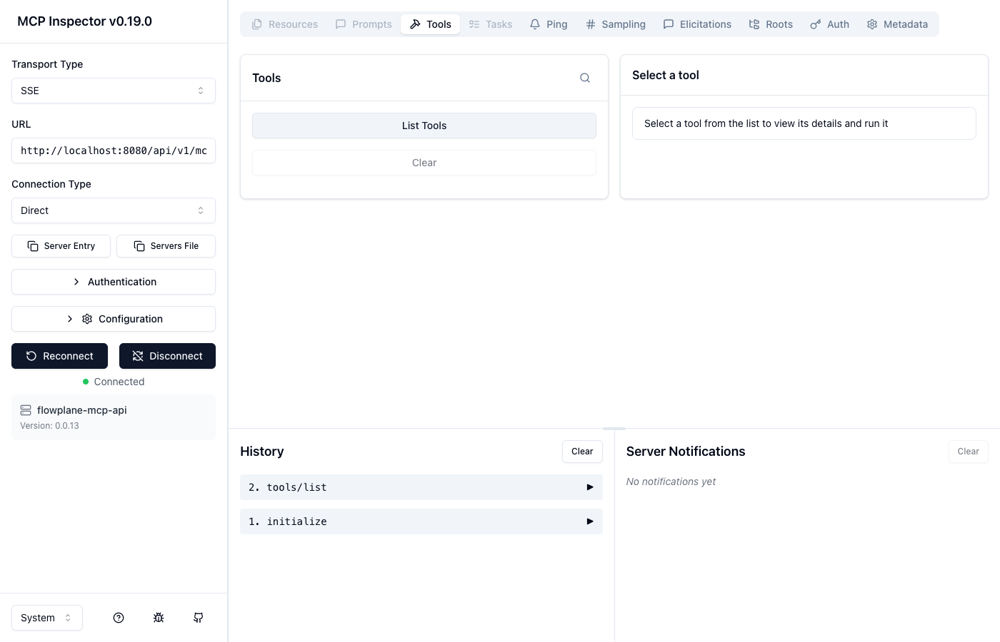

# Model Context Protocol (MCP) Integration

Flowplane provides comprehensive Model Context Protocol (MCP) support, enabling AI assistants and large language models to interact with the control plane programmatically. MCP allows LLMs to query configuration, execute control plane operations, and invoke API gateway tools.

## Overview

Flowplane implements MCP with two distinct endpoints serving different purposes:

1. **Control Plane (CP) Tools** (`/api/v1/mcp/cp`) - For managing Flowplane infrastructure (clusters, listeners, routes, filters)
2. **Gateway API Tools** (`/api/v1/mcp/api`) - For invoking backend APIs through the Envoy gateway

### Protocol Support

Flowplane implements MCP protocol versions: `2024-11-05`, `2025-03-26`, `2025-06-18`, `2025-11-25`

The server automatically negotiates the highest compatible version with the client.

## Transport Options

Flowplane supports three transport mechanisms for MCP communication:

### 1. Stdio (CLI)

The stdio transport reads JSON-RPC messages from stdin and writes responses to stdout. This is ideal for local development and command-line integration.

```bash
flowplane mcp serve --team <team-name>
```

**Use cases:**
- Local development and testing
- Integration with CLI tools
- Claude Desktop configuration

### 2. HTTP

Stateless HTTP transport for single request-response operations.

**Control Plane endpoint:**
```bash
POST /api/v1/mcp/cp?team=<team-name>
Authorization: Bearer <token>
Content-Type: application/json

{
  "jsonrpc": "2.0",
  "id": 1,
  "method": "tools/list",
  "params": {}
}
```

**Gateway API endpoint:**
```bash
POST /api/v1/mcp/api?team=<team-name>
Authorization: Bearer <token>
Content-Type: application/json

{
  "jsonrpc": "2.0",
  "id": 1,
  "method": "tools/list",
  "params": {}
}
```

**Use cases:**
- Stateless AI agent interactions
- Programmatic integrations
- Testing and debugging

### 3. Server-Sent Events (SSE)

SSE transport provides real-time streaming for progress updates, logs, and responses.

**Establish SSE connection:**
```bash
GET /api/v1/mcp/cp/sse?team=<team-name>
Authorization: Bearer <token>
```

**Response headers:**
```
Mcp-Connection-Id: <connection-id>
```

Use the `Mcp-Connection-Id` header value in subsequent HTTP POST requests to `/api/v1/mcp/cp` to link them to the SSE stream.

**Example HTTP request with SSE linkage:**
```bash
POST /api/v1/mcp/cp?team=<team-name>
Authorization: Bearer <token>
Mcp-Connection-Id: <connection-id>
```

**Use cases:**
- Long-running operations requiring progress updates
- Real-time log streaming
- Interactive AI agent sessions

**SSE Events:**
- `message` - JSON-RPC response messages
- `progress` - Progress notifications for long-running operations
- `log` - Server log messages
- `ping` - Heartbeat (every 10 seconds)

## Authentication & Authorization

All HTTP and SSE transports require bearer token authentication.

### Team Resolution

Team identity is resolved in the following priority order:

1. **Query parameter** `?team=<name>` - Explicit team specification
2. **Token scopes** - Extracted from scopes matching pattern `team:{name}:*`
3. **Admin users** - Must always provide `?team=<name>` query parameter

### Required Scopes

#### Control Plane Tools (`/api/v1/mcp/cp`)

| Method | Required Scope | Description |
|--------|---------------|-------------|
| `initialize`, `initialized`, `ping` | None | Protocol handshake |
| `tools/list`, `resources/list`, `prompts/list` | `mcp:read` | List available tools, resources, prompts |
| `tools/call`, `prompts/get` | `mcp:execute` | Execute tools and render prompts |
| `resources/read` | `cp:read` | Read resource details |
| `logging/setLevel` | `mcp:read` | Set log level for connection |

#### Gateway API Tools (`/api/v1/mcp/api`)

| Method | Required Scope | Description |
|--------|---------------|-------------|
| `initialize`, `initialized`, `ping` | None | Protocol handshake |
| `tools/list` | `api:read` | List available API tools |
| `tools/call` | `api:execute` | Execute API gateway requests |

**Note:** Users with `admin:all` scope have access to all operations but must specify the team via query parameter.

## Control Plane (CP) Tools

The CP endpoint exposes 19 built-in tools for managing Flowplane infrastructure.

### Read-Only Tools

#### `cp_list_clusters`
Lists all clusters for the team.

**Input schema:**
```json
{
  "type": "object",
  "properties": {
    "limit": { "type": "integer", "description": "Max results (default: 100)" },
    "offset": { "type": "integer", "description": "Skip N results" }
  }
}
```

#### `cp_get_cluster`
Retrieves detailed configuration for a specific cluster.

**Input schema:**
```json
{
  "type": "object",
  "properties": {
    "name": { "type": "string", "description": "Cluster name" }
  },
  "required": ["name"]
}
```

#### `cp_list_listeners`
Lists all listeners for the team.

#### `cp_get_listener`
Retrieves listener configuration including virtual hosts and filters.

**Input schema:**
```json
{
  "type": "object",
  "properties": {
    "name": { "type": "string", "description": "Listener name" }
  },
  "required": ["name"]
}
```

#### `cp_list_routes`
Lists all route configurations by querying the routes database table.

#### `cp_list_filters`
Lists all HTTP filters configured for the team.

#### `cp_get_filter`
Retrieves filter configuration and metadata.

**Input schema:**
```json
{
  "type": "object",
  "properties": {
    "name": { "type": "string", "description": "Filter name" }
  },
  "required": ["name"]
}
```

### CRUD Tools

#### Cluster Operations

**`cp_create_cluster`** - Create a new cluster with endpoints and load balancing policy.

**`cp_update_cluster`** - Update cluster configuration (endpoints, timeouts, health checks).

**`cp_delete_cluster`** - Delete a cluster (fails if referenced by routes).

#### Listener Operations

**`cp_create_listener`** - Create a new listener with address, port, and protocol.

**`cp_update_listener`** - Update listener configuration (TLS, filters, virtual hosts).

**`cp_delete_listener`** - Delete a listener.

#### Route Configuration Operations

**`cp_create_route_config`** - Create a route with path matching rules and cluster target.

**`cp_update_route_config`** - Update route path patterns, headers, or cluster mapping.

**`cp_delete_route_config`** - Delete a route configuration.

#### Filter Operations

**`cp_create_filter`** - Create a new HTTP filter (rate limiting, auth, transformation, etc.).

**`cp_update_filter`** - Update filter configuration and enabled status.

**`cp_delete_filter`** - Delete a filter.

## Resources

Resources provide read-only access to Flowplane entities via structured URIs.

### URI Format

```
flowplane://{type}/{team}/{name}
```

**Resource types:**
- `clusters` - Cluster configurations
- `listeners` - Listener configurations
- `routes` - Route configurations
- `filters` - HTTP filter configurations

### Examples

```
flowplane://clusters/production/backend-api
flowplane://listeners/production/https-listener
flowplane://routes/production/api-route-v2
flowplane://filters/staging/jwt-authentication
```

### Listing Resources

Use the `resources/list` method to discover all resources for a team:

```json
{
  "jsonrpc": "2.0",
  "id": 1,
  "method": "resources/list",
  "params": {}
}
```

**Response:**
```json
{
  "jsonrpc": "2.0",
  "id": 1,
  "result": {
    "resources": [
      {
        "uri": "flowplane://clusters/production/backend-api",
        "name": "backend-api",
        "description": "Cluster: backend-api (ROUND_ROBIN)",
        "mimeType": "application/json"
      }
    ]
  }
}
```

### Reading Resources

Use the `resources/read` method with a resource URI:

```json
{
  "jsonrpc": "2.0",
  "id": 2,
  "method": "resources/read",
  "params": {
    "uri": "flowplane://clusters/production/backend-api"
  }
}
```

**Response:**
```json
{
  "jsonrpc": "2.0",
  "id": 2,
  "result": {
    "contents": [
      {
        "uri": "flowplane://clusters/production/backend-api",
        "mimeType": "application/json",
        "text": "{\"name\":\"backend-api\",\"team\":\"production\",\"lb_policy\":\"ROUND_ROBIN\",...}"
      }
    ]
  }
}
```

## Prompts

Flowplane provides 5 built-in prompts for common troubleshooting and analysis workflows.

### Available Prompts

#### 1. `debug_route`
Analyze route configuration issues and provide diagnostic insights.

**Arguments:**
- `route_name` (required) - Name of the route to debug
- `team` (required) - Team identifier

**Example:**
```json
{
  "jsonrpc": "2.0",
  "id": 1,
  "method": "prompts/get",
  "params": {
    "name": "debug_route",
    "arguments": {
      "route_name": "api-route",
      "team": "production"
    }
  }
}
```

#### 2. `explain_filter`
Explain filter configuration and behavior in the request/response pipeline.

**Arguments:**
- `filter_name` (required) - Name of the filter to explain
- `team` (required) - Team identifier

#### 3. `troubleshoot_cluster`
Diagnose cluster connectivity and health issues.

**Arguments:**
- `cluster_name` (required) - Name of the cluster to troubleshoot
- `team` (required) - Team identifier

#### 4. `analyze_listener`
Analyze listener configuration and provide optimization recommendations.

**Arguments:**
- `listener_name` (required) - Name of the listener to analyze
- `team` (required) - Team identifier

#### 5. `optimize_performance`
Suggest performance optimizations for Flowplane configuration.

**Arguments:**
- `team` (required) - Team identifier

### Using Prompts

List available prompts:
```json
{
  "jsonrpc": "2.0",
  "id": 1,
  "method": "prompts/list",
  "params": {}
}
```

Get a rendered prompt:
```json
{
  "jsonrpc": "2.0",
  "id": 2,
  "method": "prompts/get",
  "params": {
    "name": "debug_route",
    "arguments": {
      "route_name": "api-route",
      "team": "production"
    }
  }
}
```

The response contains prompt messages ready to be used in LLM conversations with instructions for using MCP tools to gather information.

## Gateway API Tools

The Gateway API endpoint dynamically exposes tools based on routes configured with MCP metadata. These tools execute HTTP requests through the Envoy gateway.

### Tool Generation

Gateway API tools are generated from:
1. **OpenAPI specifications** - Imported route metadata
2. **Learned schemas** - Traffic analysis and schema learning
3. **Manual configuration** - Explicitly defined tool metadata

### Tool Properties

Each Gateway API tool includes:
- **Name** - Unique identifier for the tool
- **Description** - Human-readable description of what the tool does
- **Input schema** - JSON Schema defining required and optional parameters
- **HTTP method** - GET, POST, PUT, PATCH, DELETE
- **Route mapping** - Target route and cluster configuration

### Using Gateway API Tools

1. **List available tools:**
```json
{
  "jsonrpc": "2.0",
  "id": 1,
  "method": "tools/list",
  "params": {}
}
```

2. **Execute a tool:**
```json
{
  "jsonrpc": "2.0",
  "id": 2,
  "method": "tools/call",
  "params": {
    "name": "get_user_profile",
    "arguments": {
      "user_id": "123"
    }
  }
}
```

The Gateway API executor:
- Validates arguments against the input schema
- Constructs the HTTP request (method, path, headers, body)
- Forwards the request through Envoy to the target cluster
- Returns the response as MCP tool result

### Capabilities

Gateway API tools support:
- All HTTP methods (GET, POST, PUT, PATCH, DELETE)
- Path parameters and query strings
- Request headers and body
- JSON request/response handling
- Error handling and status codes

**Note:** Gateway API tools do NOT expose resources or prompts. They provide a simplified interface focused solely on API execution.

## MCP Tools Management REST API

Flowplane provides REST endpoints for managing MCP tool metadata and configuration.

### List MCP Tools

```bash
GET /api/v1/teams/{team}/mcp/tools
```

Returns all MCP tools for the team.

### Get Tool Details

```bash
GET /api/v1/teams/{team}/mcp/tools/{name}
```

Retrieves detailed configuration for a specific tool.

### Update Tool

```bash
PATCH /api/v1/teams/{team}/mcp/tools/{name}

{
  "enabled": true,
  "description": "Updated description",
  "input_schema": { ... }
}
```

### Route MCP Status

```bash
GET /api/v1/teams/{team}/routes/{route_id}/mcp/status
```

Check if MCP is enabled for a specific route and view its tool metadata.

### Enable/Disable MCP for Route

```bash
POST /api/v1/teams/{team}/routes/{route_id}/mcp/enable
POST /api/v1/teams/{team}/routes/{route_id}/mcp/disable
```

### Refresh Tool Schema

```bash
POST /api/v1/teams/{team}/routes/{route_id}/mcp/refresh
```

Refresh the tool schema from OpenAPI spec or learned data.

### Bulk Operations

```bash
POST /api/v1/teams/{team}/mcp/bulk-enable
POST /api/v1/teams/{team}/mcp/bulk-disable

{
  "route_ids": [1, 2, 3]
}
```

Enable or disable MCP for multiple routes at once.

### Learned Schema Management

```bash
GET /api/v1/teams/{team}/mcp/routes/{route_id}/learned-schema
```

Retrieve the learned schema for a route based on traffic analysis.

```bash
POST /api/v1/teams/{team}/mcp/routes/{route_id}/apply-learned
```

Apply the learned schema as the active MCP tool configuration.

## Connection Management

Monitor active MCP connections and sessions.

### List Connections

```bash
GET /api/v1/mcp/cp/connections
Authorization: Bearer <token>
```

**Response:**
```json
{
  "connections": [
    {
      "connection_id": "conn_abc123",
      "team": "production",
      "created_at": "2026-01-25T10:00:00Z",
      "last_activity": "2026-01-25T10:15:00Z",
      "log_level": "info",
      "client_info": {
        "name": "claude-desktop",
        "version": "1.0.0"
      },
      "protocol_version": "2025-11-25",
      "initialized": true,
      "connection_type": "sse"
    }
  ],
  "total_count": 1
}
```

## Server Capabilities

When clients send an `initialize` request, Flowplane advertises the following capabilities:

### Control Plane (`/api/v1/mcp/cp`)

```json
{
  "tools": { "listChanged": false },
  "resources": { "subscribe": false, "listChanged": false },
  "prompts": { "listChanged": false },
  "logging": {}
}
```

### Gateway API (`/api/v1/mcp/api`)

```json
{
  "tools": { "listChanged": false }
}
```

## Claude Desktop Configuration

To use Flowplane with Claude Desktop, add the following to your MCP configuration file:

**macOS/Linux:** `~/Library/Application Support/Claude/claude_desktop_config.json`

**Windows:** `%APPDATA%\Claude\claude_desktop_config.json`

```json
{
  "mcpServers": {
    "flowplane-cp": {
      "command": "flowplane",
      "args": ["mcp", "serve", "--team", "production"],
      "env": {
        "DATABASE_URL": "sqlite:///path/to/flowplane.db"
      }
    }
  }
}
```

**With custom database:**
```json
{
  "mcpServers": {
    "flowplane-cp": {
      "command": "flowplane",
      "args": [
        "mcp",
        "serve",
        "--team", "production",
        "--database-url", "sqlite:///Users/you/flowplane/data/flowplane.db"
      ]
    }
  }
}
```

Restart Claude Desktop to activate the MCP server. Claude will now have access to all CP tools, resources, and prompts for managing your Flowplane configuration.

## Using MCP Inspector

The [MCP Inspector](https://github.com/modelcontextprotocol/inspector) provides an interactive UI for testing MCP servers. Use it to discover tools, execute them, and inspect responses.

### Connecting to Flowplane

Connect using SSE transport with your API token in the Authorization header:

```bash
# Control Plane tools
npx @modelcontextprotocol/inspector sse \
  "http://localhost:8080/api/v1/mcp/cp/sse?team=engineering" \
  --header "Authorization: Bearer <your-token>"

# Gateway API tools
npx @modelcontextprotocol/inspector sse \
  "http://localhost:8080/api/v1/mcp/api/sse?team=engineering" \
  --header "Authorization: Bearer <your-token>"
```

### Authentication

The SSE connection requires a Bearer token. In the Inspector, expand **Authentication** to configure the `Authorization` header with your token:



### Discovering and Executing Tools

Once connected, the Inspector shows available tools with descriptions and input schemas. Select a tool, configure parameters, and click **Run Tool** to execute:



Results are displayed inline with syntax highlighting:



### CP vs API Endpoints

The **CP endpoint** (`/api/v1/mcp/cp`) exposes Resources, Prompts, and Tools tabs for full control plane management.

The **API endpoint** (`/api/v1/mcp/api`) exposes only Tools - dynamically generated from routes with MCP enabled:



## Quick Start Example

### 1. Create an MCP Token

```bash
# Using the CLI
flowplane auth tokens create \
  --name "mcp-client" \
  --scopes "mcp:read,mcp:execute,cp:read" \
  --team production

# Or via REST API
POST /api/v1/auth/tokens
{
  "name": "mcp-client",
  "scopes": ["team:production:mcp:read", "team:production:mcp:execute", "team:production:cp:read"]
}
```

### 2. Initialize MCP Connection (HTTP)

```bash
curl -X POST http://localhost:8080/api/v1/mcp/cp?team=production \
  -H "Authorization: Bearer <token>" \
  -H "Content-Type: application/json" \
  -d '{
    "jsonrpc": "2.0",
    "id": 1,
    "method": "initialize",
    "params": {
      "protocolVersion": "2025-11-25",
      "capabilities": {},
      "clientInfo": {
        "name": "my-client",
        "version": "1.0.0"
      }
    }
  }'
```

### 3. List Available Tools

```bash
curl -X POST http://localhost:8080/api/v1/mcp/cp?team=production \
  -H "Authorization: Bearer <token>" \
  -H "Content-Type: application/json" \
  -d '{
    "jsonrpc": "2.0",
    "id": 2,
    "method": "tools/list",
    "params": {}
  }'
```

### 4. Execute a Tool

```bash
curl -X POST http://localhost:8080/api/v1/mcp/cp?team=production \
  -H "Authorization: Bearer <token>" \
  -H "Content-Type: application/json" \
  -d '{
    "jsonrpc": "2.0",
    "id": 3,
    "method": "tools/call",
    "params": {
      "name": "cp_list_clusters",
      "arguments": {
        "limit": 10
      }
    }
  }'
```

## Supported MCP Methods

### Protocol Methods

| Method | Description |
|--------|-------------|
| `initialize` | Initialize MCP session and negotiate protocol version |
| `initialized` | Acknowledge successful initialization |
| `ping` | Health check and keepalive |

### Tools API

| Method | Description |
|--------|-------------|
| `tools/list` | List all available tools |
| `tools/call` | Execute a tool with arguments |

### Resources API (CP only)

| Method | Description |
|--------|-------------|
| `resources/list` | List all resources for the team |
| `resources/read` | Read a specific resource by URI |

### Prompts API (CP only)

| Method | Description |
|--------|-------------|
| `prompts/list` | List all available prompts |
| `prompts/get` | Render a prompt with arguments |

### Logging API (CP only)

| Method | Description |
|--------|-------------|
| `logging/setLevel` | Set log level filter for the connection |

### Notifications

| Notification | Description |
|--------------|-------------|
| `notifications/initialized` | Client acknowledgment of initialization |
| `notifications/cancelled` | Client cancelled a request |

## Error Handling

Flowplane returns standard JSON-RPC 2.0 error responses:

```json
{
  "jsonrpc": "2.0",
  "id": 1,
  "error": {
    "code": -32601,
    "message": "Method not found: unknown/method"
  }
}
```

### Error Codes

| Code | Constant | Description |
|------|----------|-------------|
| -32700 | PARSE_ERROR | Invalid JSON |
| -32600 | INVALID_REQUEST | Invalid request structure |
| -32601 | METHOD_NOT_FOUND | Unknown method |
| -32602 | INVALID_PARAMS | Invalid method parameters |
| -32603 | INTERNAL_ERROR | Internal server error |
| 429 | N/A | Connection limit exceeded (SSE) |

## Best Practices

### Security

1. **Use dedicated tokens** - Create separate tokens for MCP clients with minimal required scopes
2. **Scope isolation** - Grant only necessary scopes (`mcp:read` for read-only, `mcp:execute` for operations)
3. **Team boundaries** - Always specify the team to prevent cross-team access
4. **Token rotation** - Rotate MCP tokens periodically

### Performance

1. **Use SSE for long operations** - SSE provides progress updates for multi-step operations
2. **Batch reads** - Use `limit` and `offset` parameters for pagination
3. **Cache tool lists** - Tool definitions are static; cache `tools/list` results
4. **Connection reuse** - Reuse HTTP connections when possible

### Development

1. **Test with stdio** - Use stdio transport for local development and debugging
2. **Validate schemas** - Use the input_schema to validate arguments before calling tools
3. **Handle errors gracefully** - All tools can fail; check for error responses
4. **Use prompts** - Built-in prompts provide LLMs with structured troubleshooting workflows

## Troubleshooting

### Connection Refused

**Problem:** Cannot connect to MCP endpoint.

**Solution:**
- Verify Flowplane is running on the expected port (default: 8080)
- Check firewall rules allow connections
- Ensure you're using the correct URL scheme (http:// or https://)

### Authentication Errors

**Problem:** `401 Unauthorized` or `403 Forbidden` responses.

**Solution:**
- Verify token is valid and not expired
- Check token has required scopes for the operation
- Ensure team is correctly specified (query param or token scope)
- For admin users, always provide `?team=<name>` query parameter

### Protocol Version Mismatch

**Problem:** `Unsupported protocol version` error.

**Solution:**
- Check client is requesting a supported version (2024-11-05 through 2025-11-25)
- Update client or server to compatible versions
- Use an empty version string to default to oldest supported version

### SSE Connection Drops

**Problem:** SSE connection closes unexpectedly.

**Solution:**
- Check network stability
- Verify no proxy/firewall is terminating long-lived connections
- Monitor heartbeat pings (every 10 seconds)
- Check connection limit hasn't been reached

### Tool Not Found

**Problem:** `Tool not found` error when calling tools.

**Solution:**
- Verify tool name matches exactly (case-sensitive)
- For Gateway API tools, ensure MCP is enabled for the route
- Check tool is enabled (not disabled in database)
- Confirm you're using the correct endpoint (CP vs API)

## Architecture: Listener Port Binding

### Data Flow

Gateway API tools execute HTTP requests through Envoy on specific listener ports. The port is determined by:

```
Listener (has port)
  ↓ (via listener_route_configs junction table)
RouteConfig
  ↓ (1:1)
VirtualHost
  ↓ (1:N)
Route (when MCP enabled)
  ↓ (1:1)
MCP Tool (stores listener_port for execution)
```

When enabling MCP for a route, the system:
1. Queries `listener_route_configs` to find listeners bound to the route's route_config
2. Retrieves the listener's port from the `listeners` table
3. Stores this port in `mcp_tools.listener_port`
4. Uses this port when executing HTTP requests: `http://localhost:{listener_port}{path}`

### Important Constraints

**Single Listener Requirement**: Currently, if a route_config has multiple listeners, the system picks the first one by `route_order`. This may not always be the intended listener for MCP execution.

### Port Validation

Listeners MUST have a port configured. The system validates port configuration and returns explicit errors if:
- No listeners are bound to the route's route_config
- The listener has a NULL port value

If validation fails, MCP enablement is rejected with a descriptive error message indicating the specific configuration issue.

### Multiple Listeners

When a route_config has multiple listeners (e.g., HTTP on 8080 and HTTPS on 8443), the current behavior:
- Selects the first listener by `route_order` in the `listener_route_configs` table
- Logs a warning if multiple listeners are found
- Creates a single MCP tool with the selected listener's port

**Future Enhancement**: Consider supporting multiple tools per route (one per listener) or allowing explicit listener selection during MCP enablement.

## Further Reading

- [Authentication](./cli.md#authentication) - Token management and scopes
- [API Reference](./getting-started.md) - REST API documentation
- [Architecture](./architecture.md) - Flowplane system design
- [MCP Specification](https://modelcontextprotocol.io/) - Official MCP protocol documentation
