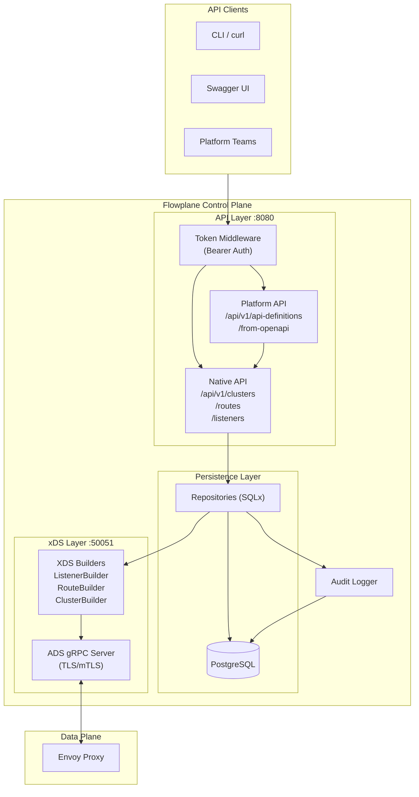

# Flowplane Architecture

Flowplane is a production-ready Envoy control plane that translates REST API calls into Envoy xDS resources.

## High-Level Flow

1. **Authentication Layer** — Token middleware validates bearer tokens with scope-based authorization
2. **API Handlers** — Accept JSON payloads, validate schemas, enforce permissions, persist to database
3. **Audit System** — All auth events and resource changes logged to `audit_logs` table
4. **xDS Builders** — Transform stored records into Envoy protobuf resources (Listener, Route, Cluster)
5. **ADS Server** — gRPC server publishes resources to Envoy proxies via TLS/mTLS
6. **Platform API** — Higher-level abstractions for API gateway workflows (OpenAPI import, shared listeners)



## Key Components

| Component | Port | Purpose |
|-----------|------|---------|
| REST API | 8080 | Resource management (clusters, routes, listeners, filters) |
| ADS gRPC | 50051 | xDS protocol — pushes config to Envoy proxies |
| PostgreSQL | 5432 | Configuration persistence, audit logs |

## Security Model

- **Bearer token auth** on all API endpoints
- **Scoped permissions**: `clusters:read`, `clusters:write`, `routes:read`, `routes:write`, `listeners:read`, `listeners:write`, `tokens:read`, `tokens:write`
- **Audit trail** for all auth events and resource changes
- **TLS/mTLS** for xDS communication with Envoy

## Multi-Tenancy

- **Organizations** contain **Teams**; all resources belong to teams
- **Shared listener mode** (default): teams share `default-gateway-listener` on port 10000
- **Dedicated listener mode**: per-team listener with full isolation
- Resources namespaced by team prefix in Platform API

## Resource Flow

```
API Request (JSON)
  → Validation + Auth
    → Database (PostgreSQL)
      → xDS Builder (Rust structs → Envoy protos)
        → ADS Server (gRPC stream)
          → Envoy Proxy (applies config)
```

## MCP Integration

Flowplane exposes 60+ MCP tools for AI-driven gateway management:
- **CP endpoint** (`/api/v1/mcp/cp`): Full control plane tools, resources, and prompts
- **API endpoint** (`/api/v1/mcp/api`): Gateway API execution tools (dynamically generated from routes)
- Three built-in agent personas: Dev, Ops, DevOps
